# 🛡️ Enterprise Observability & DevSecOps Platform

An end-to-end Kubernetes monitoring stack combined with a security-gated CI/CD pipeline — built from scratch on AWS with `kubeadm`, Prometheus, Grafana, Jenkins, SonarQube, and Trivy.

[](https://aws.amazon.com/)
[](https://kubernetes.io/)
[](https://www.docker.com/)
[](https://www.jenkins.io/)
[](https://prometheus.io/)
[](https://grafana.com/)
[](https://www.sonarsource.com/products/sonarqube/)
[](https://aquasecurity.github.io/trivy/)
[](https://github.com/gitleaks/gitleaks)
[](LICENSE)

---

## 📖 Overview

This project is **Capstone 3** of a hands-on DevOps portfolio: a production-style **Enterprise Observability & DevSecOps Platform**. It combines a self-managed Kubernetes cluster on AWS with a full monitoring/alerting stack and a 9-stage security-gated Jenkins pipeline, taking an application from source code to a monitored, alerting-aware deployment.

Full requirement-by-requirement documentation, design rationale, and known limitations are recorded in [`MONITORING-DOCUMENTATION.md`](./MONITORING-DOCUMENTATION.md).

---

## 🏗️ Architecture

```
AWS (ap-south-1)
│
├── Kubernetes Cluster (kubeadm, 3× t3.small, Ubuntu 24.04)
│   ├── k8s-master       — control plane
│   ├── k8s-worker-1      — application + monitoring workloads
│   ├── k8s-worker-2      — application + monitoring workloads
│   │
│   ├── Networking: Calico CNI
│   │
│   ├── monitoring namespace
│   │   ├── Prometheus (kube-prometheus-stack)
│   │   ├── Grafana
│   │   ├── AlertManager
│   │   ├── Node Exporter (DaemonSet)
│   │   └── kube-state-metrics
│   │
│   └── demo-app namespace
│       └── demo-app deployment (2 replicas, custom nginx-based image)
│
├── Jenkins (dedicated t3.small EC2)
│   ├── Jenkins Controller + Prometheus plugin
│   ├── SonarQube Scanner CLI
│   ├── Trivy · Gitleaks · OWASP Dependency-Check
│   ├── Docker Engine · kubectl
│   └── Node Exporter (host metrics)
│
└── SonarQube (dedicated c7i-flex.large EC2)
    └── SonarQube Community Edition (Docker)
```

Jenkins and SonarQube run outside the Kubernetes cluster on their own EC2 instances — this avoids the circular dependency of a deploy pipeline depending on the cluster it ships to, and keeps SonarQube's memory-hungry Elasticsearch off the cluster's `t3.small` nodes.

---

## ✨ Features

- **Self-managed Kubernetes cluster** — built with `kubeadm` + Calico CNI across 3 EC2 nodes (not EKS)
- **Full observability stack** — Prometheus, Grafana, AlertManager, Node Exporter, and kube-state-metrics via `kube-prometheus-stack`
- **7 custom alert rules** — CPU, memory, disk, node health, pod crash-looping, application availability, and restart-rate, verified to actually reach `firing` state
- **9-stage security-gated Jenkins pipeline** — checkout → secret detection → dependency scan → SonarQube scan → quality gate → Docker build → image scan → registry push → Kubernetes deploy → rollout verification
- **Proven, not just configured, security gates** — Trivy verified blocking a vulnerable image; SonarQube Quality Gate verified blocking real code issues (a Security Hotspot and an accessibility bug), both fixed before the pipeline could pass
- **Infrastructure-wide monitoring** — covers the Kubernetes cluster, the Jenkins host/build pipeline, Docker, and the application, not Kubernetes alone

---

## 🧰 Tech Stack

| Category | Tools |
|---|---|
| Cloud | AWS EC2 (ap-south-1) |
| Orchestration | Kubernetes (kubeadm), Calico CNI |
| Monitoring | Prometheus, Grafana, AlertManager, Node Exporter, kube-state-metrics |
| CI/CD | Jenkins |
| Code Quality | SonarQube Community Edition |
| Security | Trivy (image scanning), Gitleaks (secret detection), OWASP Dependency-Check |
| Containers | Docker, Docker Hub |
| Application | nginx (custom hardened image, non-root user) |

---

## 🔄 Pipeline Flow

```
Checkout
    ↓
Secret Detection (Gitleaks)
    ↓
Dependency Scanning (OWASP Dependency-Check)
    ↓
SonarQube Scan
    ↓
Quality Gate
    ↓
Docker Build
    ↓
Image Scan (Trivy)
    ↓
Push to Docker Hub
    ↓
Deploy to Kubernetes
    ↓
Rollout Verification
```

Each build produces a uniquely-tagged image (`eldho10/capstone3-demo-app:<build-number>`), so every deployment is traceable to the exact pipeline run that produced it.

---

## 📸 Screenshots

**Kubernetes cluster ready (kubeadm + Calico)**
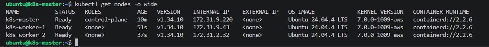

**Grafana home dashboard**
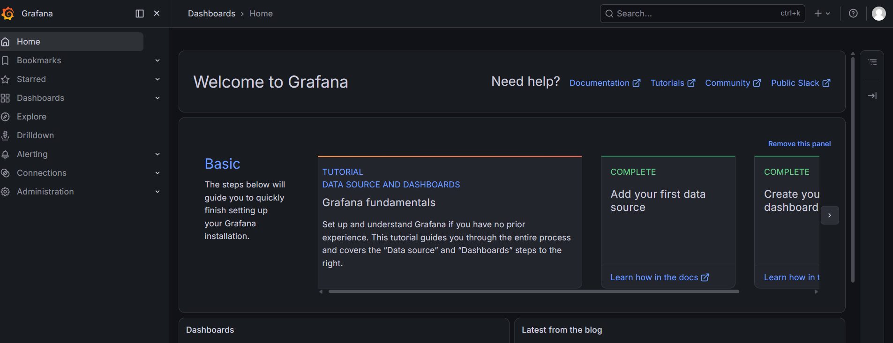

**Prometheus targets up**
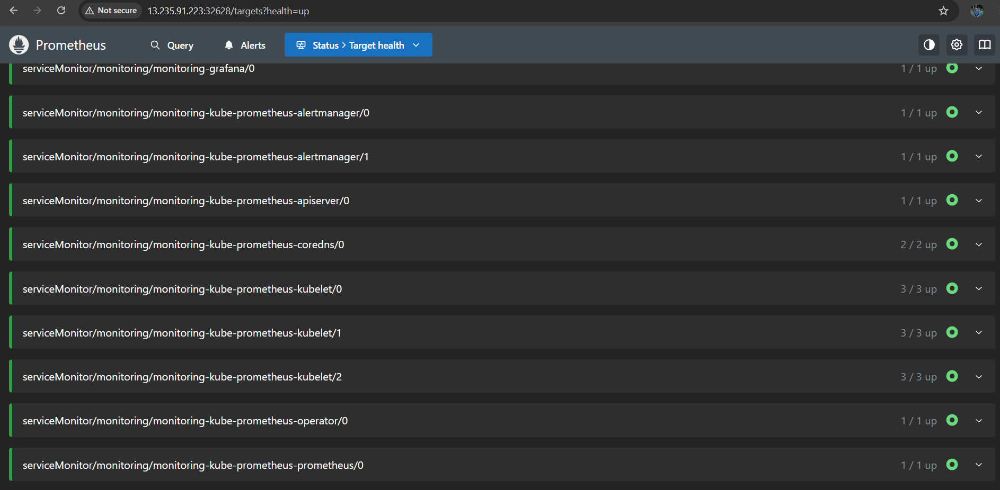

**Grafana Kubernetes dashboard**
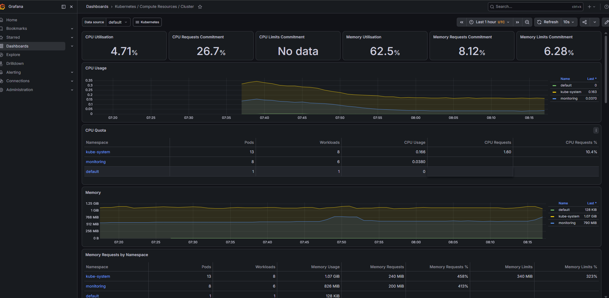

**Custom alert rules applied**
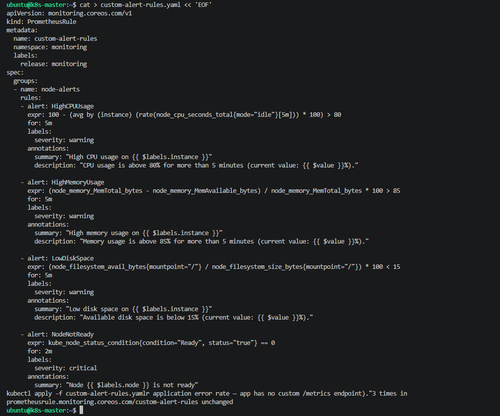

**ApplicationDown alert firing**
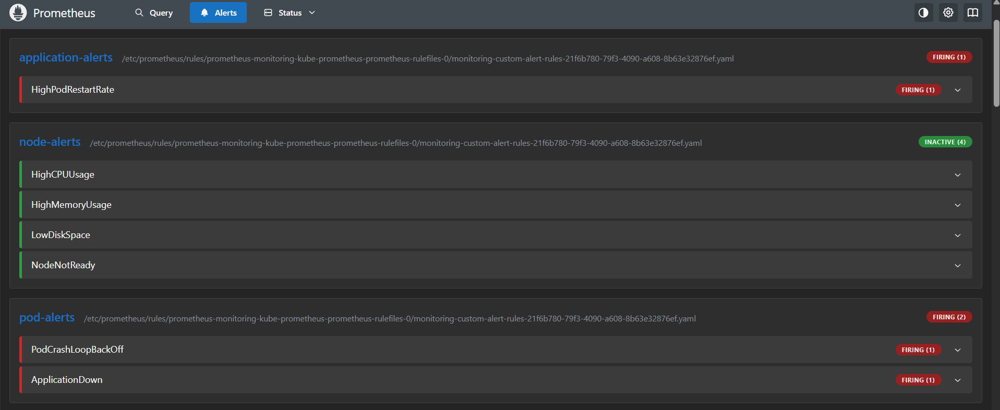

**AlertManager active alerts**
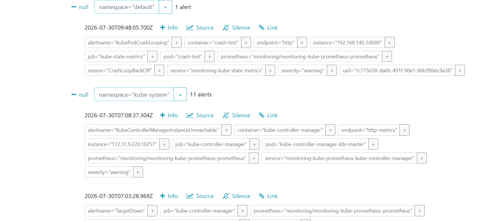

**SonarQube dashboard**
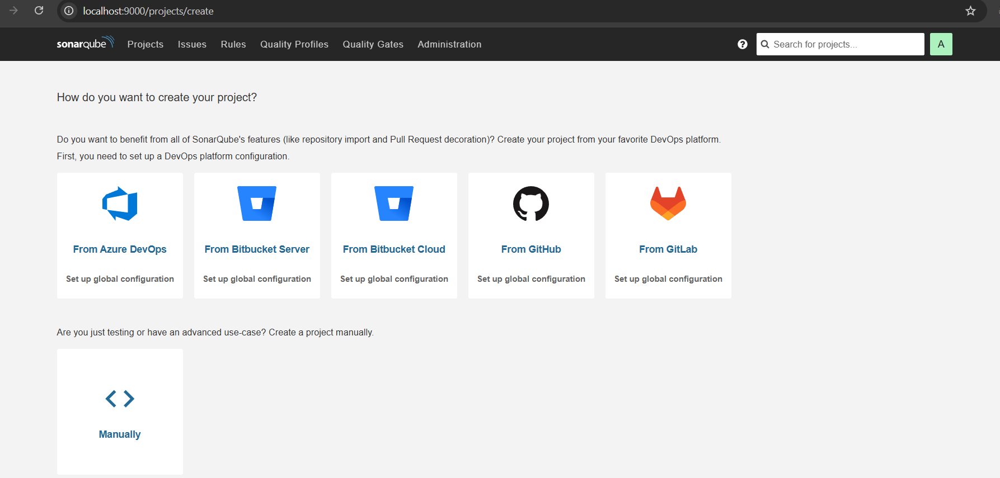

**Trivy blocking a vulnerable build in Jenkins**
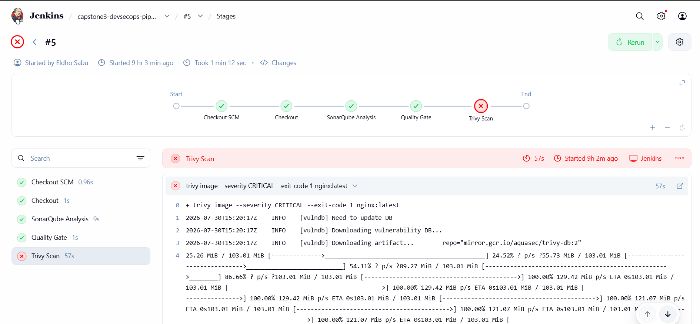

**Image pushed to Docker Hub**
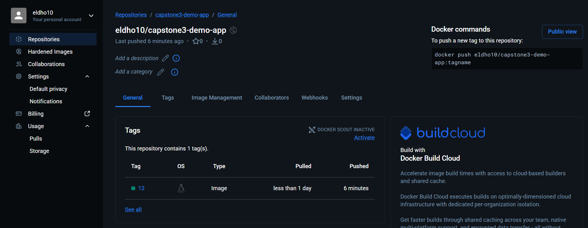

**Final pipeline — all 9 stages passing**
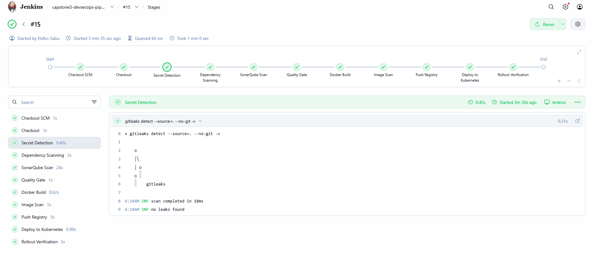

> The full 30-screenshot index (infra bring-up, monitoring validation, alerting proofs, and pipeline evolution) is documented in [`MONITORING-DOCUMENTATION.md`](./MONITORING-DOCUMENTATION.md#10-screenshot-index).

---

## 📂 Repository Structure

```
.
├── Dockerfile                       # Hardened nginx image (non-root user)
├── app/
│   └── index.html                   # Demo application content
├── jenkins/
│   └── Jenkinsfile                  # 9-stage CI/CD pipeline
├── monitoring/
│   └── custom-alert-rules.yaml      # 7 PrometheusRule alert definitions
├── trivy/
│   └── trivy-scan-command.md        # Reusable Trivy gate command
├── screenshots/                     # Evidence for every deliverable (01–30)
└── MONITORING-DOCUMENTATION.md      # Full requirement-by-requirement write-up
```

---

## ⚠️ Known Limitations

- **OWASP Dependency-Check** does not reliably complete NVD database synchronization in this lab network, so the stage is intentionally non-blocking rather than masking the underlying issue.
- **HighPodRestartRate** substitutes for a literal HTTP error-rate alert, since the demo application has no instrumented `/metrics` endpoint. Documented in detail in `MONITORING-DOCUMENTATION.md`.
- A few AWS security group rules remain open to `0.0.0.0/0` rather than scoped to a single administrator IP; a known cleanup item that doesn't affect the functional deliverables.

---

## 👤 Author

**Eldho Sabu**
DevOps / Cloud Engineer (AWS)

[](https://github.com/Eldho2827)
[](https://www.linkedin.com/in/eldhosabu08)

---

## 📄 License

This project is licensed under the MIT License.
